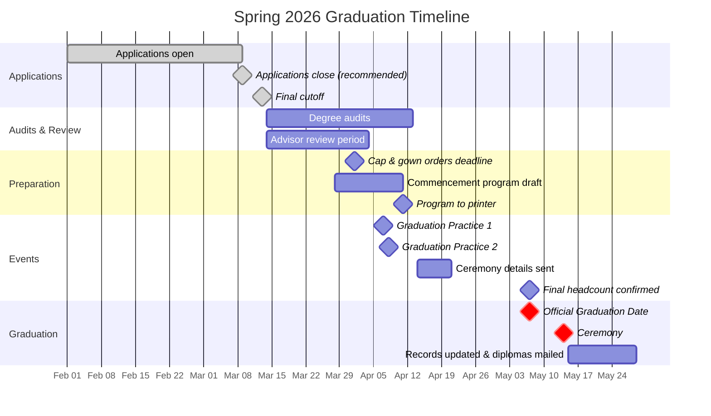

# 📅 Graduation Timelines

Semester-by-semester timelines and key deadlines.

---

## Current Timeline

### Spring 2026



| Task | Target Date | Status | Notes |
|---|---|---|---|
| Graduation applications open | 2026-02-01 | ✅ | |
| Graduation applications close (recommended deadline) | 2026-03-09 | ✅ | Midterm of final semester |
| Graduation applications final cutoff | 2026-03-13 | ✅ | Absolute last day to apply |
| Preliminary candidate list compiled | 2026-03-14 | | Day after final cutoff |
| Degree audits begin | 2026-03-14 | | Advisors run EVAL in Colleague; upload PDF to Advising Hub |
| Advisors notified — review period begins | 2026-03-14 | | Automated email sent when student applies via Success Hub |
| Advisor review period ends | 2026-04-04 | | 21 days after audits begin |
| Degree audits complete | 2026-04-13 | | Final Technical Audits completed by Student Records & Registrar |
| Commencement program draft due | 2026-03-28 | | |
| Cap & gown orders deadline | 2026-04-01 | | Herff Jones; black caps and gowns only |
| Commencement program submitted to printer | 2026-04-11 | | |
| Graduation Practices | 2026-04-07 and 2026-04-08 | | Sanford Civic Center; graduates attend one session only |
| Ceremony details sent to graduates | 2026-04-14 | | Include arrival time (45 min early), assigned ceremony info |
| Final headcount confirmed | 2026-05-07 | | |
| **Official Graduation Date** | **2026-05-07** | | Last day of the spring term |
| **Ceremony Date** | **2026-05-14** | | Dennis A. Wicker Civic & Conference Center |
| Final graduation list submitted to records | 2026-05-15 | | |
| Student records updated with graduation status | 2026-05-15 | | |
| Diplomas mailed | 2026-05-22 | | 7–10 days after processing |

---

## Upcoming: Fall 2026

| Task | Target Date | Status | Notes |
|---|---|---|---|
| Graduation applications open | <!-- e.g., 2026-08-01 --> | | |
| Graduation applications close | <!-- e.g., 2026-10-01 --> | | |
| Degree audits complete | | | |
| Ceremony Date | | | |
| Diplomas mailed | | | |

---

## Past Timelines

### Fall 2025

| Task | Date | Notes |
|---|---|---|
| Applications closed | | |
| Ceremony | | |
| Diplomas mailed | | |

<!-- Add additional past timelines as needed -->

---

## Timeline Template

Copy the block below when starting a new term's timeline:

```markdown
### [Term Year]

| Task | Target Date | Status | Notes |
|---|---|---|---|
| Graduation applications open | | | |
| Graduation applications close | | | |
| Preliminary candidate list compiled | | | |
| Degree audits begin | | | |
| Advisors notified | | | |
| Degree audits complete | | | |
| Commencement program submitted | | | |
| Cap & gown orders deadline | | | |
| Ceremony details sent to graduates | | | |
| Rehearsal | | | |
| Ceremony Date | | | |
| Final list submitted to records | | | |
| Student records updated | | | |
| Diplomas mailed | | | |
```